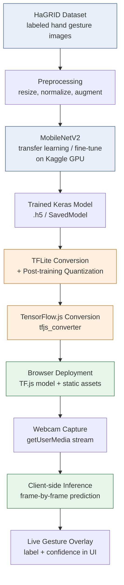

# GestureLens

Real-time hand gesture recognition that runs entirely in the browser — no backend, no server round-trip, no data ever leaving the client.

A MobileNetV2 classifier is fine-tuned on the HaGRID dataset, quantized to TFLite for efficiency, and converted to TensorFlow.js so inference happens live off webcam frames in a standard browser tab.

> **Note:** Fill in the `[TODO]` markers below with your actual numbers (accuracy, latency, repo URL, license, etc.) before publishing — placeholders are left intentionally rather than invented.

---

## Why this project exists

Most gesture-recognition demos either (a) require a native app / server inference endpoint, or (b) are too heavy to run on constrained hardware. GestureLens is built to prove the opposite is possible:

- **Train once, deploy anywhere** — model is trained on Kaggle GPUs, then shrunk down for edge/browser use.
- **Privacy by construction** — webcam frames never leave the device; classification happens client-side.
- **Runs on modest hardware** — validated locally on a 2019 Intel MacBook Pro (8GB RAM, no discrete GPU).

This pairs conceptually with the "on-device, privacy-first" theme in OmniSort AI, and demonstrates the train → quantize → deploy → browser-inference lifecycle end to end.

---

## Pipeline overview



**Stages in plain terms:**

1. **Data** — HaGRID gesture images, split into train/val/test.
2. **Train** — MobileNetV2 backbone fine-tuned for the gesture classes, run on Kaggle's free GPU tier.
3. **Compress** — converted to TFLite with post-training quantization to cut model size and latency.
4. **Port to web** — TFLite/Keras model converted to TensorFlow.js format so it can load in-browser.
5. **Serve** — a lightweight static frontend loads the TF.js model and requests webcam access.
6. **Infer** — each video frame is run through the model client-side; no network calls during inference.
7. **Display** — predicted gesture + confidence score rendered as a live overlay.

---

## Suggested repo structure

```
gesturelens/
├── README.md
├── LICENSE                          # [TODO: choose a license]
│
├── training/
│   ├── notebooks/
│   │   └── train_mobilenetv2_hagrid.ipynb   # Kaggle training notebook
│   ├── data_prep/
│   │   ├── download_hagrid.py
│   │   └── preprocess.py            # resize/normalize/augment
│   ├── train.py                     # standalone training script (mirrors notebook)
│   ├── evaluate.py                  # accuracy / confusion matrix / per-class report
│   └── requirements.txt
│
├── conversion/
│   ├── keras_to_tflite.py           # quantization step
│   ├── tflite_to_tfjs.sh            # tensorflowjs_converter wrapper
│   └── model_cards/
│       └── gesturelens_v1.md        # model size, input shape, class list
│
├── models/
│   ├── keras/                       # original .h5 / SavedModel (not committed if large — use Git LFS or release assets)
│   ├── tflite/
│   │   └── gesturelens_quant.tflite
│   └── tfjs/
│       ├── model.json
│       └── group1-shard*.bin
│
├── web/
│   ├── index.html
│   ├── src/
│   │   ├── camera.js                 # getUserMedia handling
│   │   ├── inference.js              # tf.js load + predict loop
│   │   ├── overlay.js                # label/confidence rendering
│   │   └── main.js
│   ├── public/
│   │   └── assets/
│   ├── package.json
│   └── vite.config.js               # or webpack config, depending on tooling used
│
├── tests/
│   ├── test_preprocessing.py
│   └── test_inference_shapes.py
│
└── docs/
    ├── benchmarks.md                 # latency/FPS/accuracy tables
    └── demo.gif                      # [TODO: record a short demo clip]
```

---

## Model details

| Property | Value |
|---|---|
| Backbone | MobileNetV2 (transfer learning, fine-tuned head/top layers) |
| Training data | HaGRID (Hand Gesture Recognition Image Dataset) |
| Training environment | Kaggle notebooks (GPU) |
| Compression | TFLite conversion + post-training quantization |
| Deployment format | TensorFlow.js (browser inference) |
| Input | Webcam frame, resized to model's expected input shape `[TODO: e.g. 224x224x3]` |
| Output | Gesture class label + confidence score |
| Validated inference environment | 2019 Intel MacBook Pro, 8GB RAM, no dGPU |
| Classes | `[TODO: list the HaGRID gesture classes you trained on]` |
| Top-1 accuracy | `[TODO]` |
| Inference latency (browser) | `[TODO: ms/frame or FPS]` |
| Quantized model size | `[TODO: MB]` vs. original `[TODO: MB]` |

---

## Getting started

### 1. Train (or use the provided model)
```bash
cd training
pip install -r requirements.txt
python train.py --epochs [TODO] --batch-size [TODO]
```

### 2. Convert for deployment
```bash
cd conversion
python keras_to_tflite.py --model ../models/keras/model.h5 --quantize
bash tflite_to_tfjs.sh
```

### 3. Run the web demo
```bash
cd web
npm install
npm run dev
```
Open the local dev URL, grant webcam permission, and hold up a gesture.

---

## Design notes / trade-offs

- **Why TFLite → TF.js instead of a Python backend?** Removing the server hop eliminates latency, hosting cost, and a whole class of privacy concerns — frames are classified where they're captured.
- **Why MobileNetV2?** Chosen specifically for its depthwise-separable convolutions, which keep parameter count and FLOPs low enough for real-time inference on CPU-only client devices.
- **Why validate on a low-spec MacBook?** To stress-test the "runs anywhere" claim against something weaker than a typical dev machine, rather than only benchmarking on the training GPU.

---

## Roadmap / possible extensions

- [ ] Add temporal smoothing (majority vote over last N frames) to reduce flicker in predictions
- [ ] Expand gesture vocabulary beyond the initial HaGRID subset
- [ ] Add a WebGL vs. WASM backend comparison for TF.js inference speed
- [ ] Package as a browser extension or embeddable widget
- [ ] Add ONNX export path for cross-framework portability

---

## Acknowledgments

- [HaGRID dataset](https://github.com/hukenovs/hagrid) authors
- TensorFlow / TensorFlow.js and TFLite teams

## License

`[TODO: add license, e.g. MIT]`
